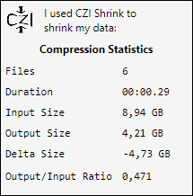
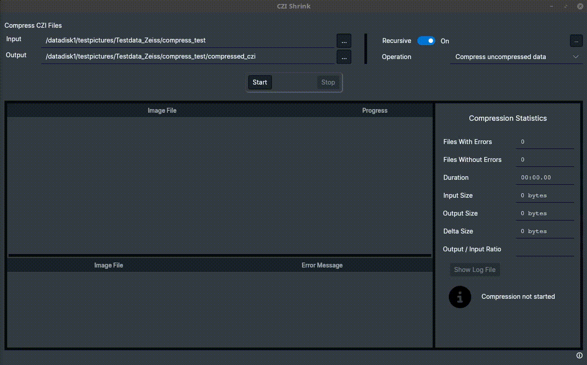

# Smart Microscopy On-site Workshop: From Zero to Hero with ZEN and Open-Source Tools

- [Smart Microscopy On-site Workshop: From Zero to Hero with ZEN and Open-Source Tools](#smart-microscopy-on-site-workshop-from-zero-to-hero-with-zen-and-open-source-tools)
  - [Disclaimer](#disclaimer)
  - [General Remarks](#general-remarks)
  - [Prerequisites](#prerequisites)
    - [Install python base  environment (miniconda etc.)](#install-python-base--environment-miniconda-etc)
  - [ZEN API](#zen-api)
    - [ZEN API - General Information](#zen-api---general-information)
    - [ZEN API - ZEN Blu 3.12 - Documentation](#zen-api---zen-blu-312---documentation)
    - [ZEN API Python Examples](#zen-api-python-examples)
      - [ShowCase: Pixel Stream and Online Processing](#showcase-pixel-stream-and-online-processing)
      - [ShowCase: Guided Acquisition](#showcase-guided-acquisition)
  - [Deep Learning Topics](#deep-learning-topics)
    - [Train a Deep-Learning Model for Semantic Segmentation on arivis Cloud](#train-a-deep-learning-model-for-semantic-segmentation-on-arivis-cloud)
    - [Use the model in your python code](#use-the-model-in-your-python-code)
    - [Train your own model and package (as \*.czann) using the czmodel package](#train-your-own-model-and-package-as-czann-using-the-czmodel-package)
    - [Train a simple model for semantic segmentation](#train-a-simple-model-for-semantic-segmentation)
    - [Train a simple model for regression](#train-a-simple-model-for-regression)
    - [Use the model inside Napari (experimental)](#use-the-model-inside-napari-experimental)
  - [Using the czitools package (experimental)](#using-the-czitools-package-experimental)
    - [Read CZI metadata](#read-czi-metadata)
    - [Read CZI pixeldata](#read-czi-pixeldata)
    - [Write OME-ZARR from 5D CZI image data](#write-ome-zarr-from-5d-czi-image-data)
    - [Write CZI using ZSTD compression](#write-czi-using-zstd-compression)
    - [Show planetable of a CZI image as surface](#show-planetable-of-a-czi-image-as-surface)
    - [Read a CZI and segment using Voroni-Otsu provided by PyClesperanto GPU processing](#read-a-czi-and-segment-using-voroni-otsu-provided-by-pyclesperanto-gpu-processing)
  - [CZICompress - Compress CZI image files from the commandline](#czicompress---compress-czi-image-files-from-the-commandline)
    - [General usage](#general-usage)
    - [Usage example for single files from commandline (cmd.exe)](#usage-example-for-single-files-from-commandline-cmdexe)
    - [Usage example with multiple files (bash)](#usage-example-with-multiple-files-bash)
  - [CZIShrink - Compress CZI image files from a cross-platform UI](#czishrink---compress-czi-image-files-from-a-cross-platform-ui)
  - [CZICheck - Check CZI for internal errors](#czicheck---check-czi-for-internal-errors)
  - [napari-czitools (experimental)](#napari-czitools-experimental)
  - [CZI and OME-ZARR (experimental)](#czi-and-ome-zarr-experimental)
    - [Convert CZI to OME-ZARR using ome-zarr](#convert-czi-to-ome-zarr-using-ome-zarr)
    - [Convert CZI to OME-ZARR using ngff-zarr](#convert-czi-to-ome-zarr-using-ngff-zarr)
    - [Convert CZI to OME-ZARR HCS Plate using ome-zarr](#convert-czi-to-ome-zarr-hcs-plate-using-ome-zarr)
    - [Convert CZI to OME-ZARR HCS Plate using ngff-zarr](#convert-czi-to-ome-zarr-hcs-plate-using-ngff-zarr)
  - [Links](#links)

## Disclaimer

This content of this repository is free to use for everybody and purely experimental. The authors undertakes no warranty concerning the use of those scripts, image analysis settings and ZEN experiments, especially not for the examples using 3rd python modules. Use them on your own risk.

**By using any of those examples you agree to this disclaimer.**

## General Remarks

This repository contains scripts and notebooks showcasing several tools and scripts centered around ZEN, CZI image files, deep-learning models and related python packages.

## Prerequisites

### Install python base  environment (miniconda etc.)

- Download and install Miniconda if needed: [Download Miniconda](https://www.anaconda.com/download/success)
- Install Jupyter & Co

```cmd
conda activate base
conda install jupyterlab jupyter_server nb_conda_kernels
```

To run the notebooks locally it is recommended to create a fresh conda environment. Please feel free to use the provided [YML file](workshop/env_smartmic.yml) (at your own risk) to create such an environment:

```cmd
conda env create --file zen_smartmic.yml
```

> Important: If one wants to test the labeling & training directly on [arivis Cloud] or create a module it is required to have an account.
>
> To use [Colab] one needs to have a Google account.
>
> To test and run an [arivis Cloud] module locally one needs [Docker Desktop] installed.

## ZEN API

### ZEN API - General Information

- See: **[ZEN API -General Information](https://github.com/zeiss-microscopy/OAD/blob/master/ZEN-API/README.md)**

### ZEN API - ZEN Blu 3.12 - Documentation

- See: **[ZEN API Documentation](https://github.com/zeiss-microscopy/OAD/blob/master/ZEN-API/documentation/ZEN_API_Documentation_20250509.md)**

### ZEN API Python Examples

All examples can be found at: **[ZEN API Examples - ZEN Blue 3.12](https://github.com/sebi06/ZEN_Python_CZI_Smart_Microscopy_Workshop/tree/main/workshop/zen_api)**


#### ShowCase: Pixel Stream and Online Processing

ZEN running an acquisition while the PixelStream is processed by a python client. For the code can be found at: [zenapi_streaming.py](./python_examples/zenapi_streaming.py)


#### ShowCase: Guided Acquisition

ZEN running a simple "guided acquisition" where the overview image is analyzed using python. Subsequently all found objects are acquire automatically. For the code can be found at: [zenapi_guidedacq.py](./python_examples/zenapi_guidedacq.py)


## Deep Learning Topics

### Train a Deep-Learning Model for Semantic Segmentation on arivis Cloud

The general idea is to learn how to label a dataset on [arivis Cloud].

Dataset Name: **Smart_Microscopy_Workshop_2025_Nucleus_Semantic**


- label some nuclei "precisely"
- label background areas and edges
- embrace the idea of partial labeling


- start a training to get a trained model as a *.czann file

Remark: The the modelfile: **cyto2022_nuc2.czann** can be found inside the repository.

For more detailed information please visit: [Docs - Partial Annotations](https://docs.apeer.com/machine-learning/annotation-guidelines)

### Use the model in your python code

Once the model is trained it can be downloaded directly to your hard disk and used to segment images in ZEN or arivis Pro or your own python code.

[](https://colab.research.google.com/github/sebi06/ZEN_Python_CZI_Smart_Microscopy_Workshop/blob/main/workshop/notebooks/run_prediction_from_czann.ipynb)

### Train your own model and package (as *.czann) using the [czmodel] package

The package provides simple-to-use conversion tools to generate a CZANN file from a [PyTorch] or [ONNX] model that resides in memory or on disk to be usable in the ZEN, arivis Cloud, arivisPro software platforms and also in your own code.

For details and more information examples please go to: [czmodel]

### Train a simple model for semantic segmentation

[](https://colab.research.google.com/github/sebi06/ZEN_Python_CZI_Smart_Microscopy_Workshop/blob/main/workshop/notebooks/SingleClassSemanticSegmentation_PyTorch.ipynb)

### Train a simple model for regression

[](https://colab.research.google.com/github/sebi06/ZEN_Python_CZI_Smart_Microscopy_Workshop/blob/main/workshop/notebooks/Regresssion_PyTorch.ipynb)

### Use the model inside Napari (experimental)

This plugin is purely experimental. The authors undertakes no warranty concerning its use.

In order to use such a model one needs a running python environment with [Napari] and the [napari-czann-segment] plugin installed.

It can install it via [pip]:

```cmd
pip install napari-czann-segment
```

For more detailed information about the plugin please go to: [Napari Hub - napari-czann-segment](https://www.napari-hub.org/plugins/napari-czann-segment)


## Using the [czitools] package (experimental)

This python package is purely experimental. The authors undertakes no warranty concerning its use.

For details please visit: [czitools]

### Read CZI metadata

[](https://colab.research.google.com/github/sebi06/czitools/blob/main/demo/notebooks/read_czi_metadata.ipynb)

### Read CZI pixeldata

[](https://colab.research.google.com/github/sebi06/czitools/blob/main/demo/notebooks/read_czi_pixeldata_simple.ipynb)

### Write OME-ZARR from 5D CZI image data

[](https://colab.research.google.com/github/sebi06/czitools/blob/main/demo/notebooks/omezarr_from_czi_5d.ipynb)

### Write CZI using ZSTD compression

[](https://colab.research.google.com/github/sebi06/czitools/blob/main/demo/notebooks/save_with_ZSTD_compression.ipynb)

### Show planetable of a CZI image as surface

[](https://colab.research.google.com/github/sebi06/czitools/blob/main/demo/notebooks/show_czi_surface.ipynb)

### Read a CZI and segment using Voroni-Otsu provided by PyClesperanto GPU processing

[](https://colab.research.google.com/github/sebi06/czitools/blob/main/demo/notebooks/read_czi_segment_voroni_otsu.ipynb)

## CZICompress - Compress CZI image files from the commandline

Starting with ZEN 3.9 ZSTD (Z-Standard) will be the new default compression method in ZEN (it was already available longer), but obviously there are already many existing CZI image files "out there" and how to deal with existing ZEN installations that can read uncompressed CZIs but not compressed CZIs?

Therefore we created a command line tool:

- compress or decompress a single CZI file
- versatile
- scriptable
- run in headless/server environments
- run in cron jobs
- cross-platform (focus on linux-x64 and win-x64)
- public Github repository: [CZICompress]

### General usage

Start the executable from the command line, providing the required command line arguments.

    Usage: czicompress [OPTIONS]

    Options:
    -h,--help         Print this help message and exit

    -c,--command COMMAND
                        Specifies the mode of operation: 'compress' to convert to a
                        zstd-compressed CZI, 'decompress' to convert to a CZI
                        containing only uncompressed data.

    -i,--input SOURCE_FILE
                        The source CZI-file to be processed.

    -o,--output DESTINATION_FILE
                        The destination CZI-file to be written.

    -s,--strategy STRATEGY
                        Choose which subblocks of the source file are compressed.
                        STRATEGY can be one of 'all', 'uncompressed',
                        'uncompressed_and_zstd'. The default is 'uncompressed'.

    -t,--compression_options COMPRESSION_OPTIONS
                        Specify compression parameters. The default is
                        'zstd1:ExplicitLevel=0;PreProcess=HiLoByteUnpack'.


    Copies the content of a CZI-file into another CZI-file changing the compression
    of the image data.
    With the 'compress' command, uncompressed image data is converted to
    Zstd-compressed image data. This can reduce the file size substantially. With
    the 'decompress' command, compressed image data is converted to uncompressed
    data.
    For the 'compress' command, a compression strategy can be specified with the
    '--strategy' option. It controls which subblocks of the source file will be
    compressed. The source document may already contain compressed data (possibly
    with a lossy compression scheme). In this case it is undesirable to compress the
    data with lossless zstd, as that will almost certainly increase the file size.
    Therefore, the "uncompressed" strategy compresses only uncompressed subblocks.
    The "uncompressed_and_zstd" strategy compresses the subblocks that are
    uncompressed OR compressed with Zstd, and the "all" strategy compresses all
    subblocks, regardless of their current compression status. Some compression
    schemes that can occur in a CZI-file cannot be decompressed by this tool. Data
    compressed with such a scheme will be copied verbatim to the destination file,
    regardless of the command and strategy chosen.

### Usage example for single files from commandline (cmd.exe)

```cmd
SET PATH=$PATH;C:\Users\y1mrn\Downloads\czicompress
cd /D D:\TestData

czicompress --command compress -i LLS-31Timepoints-2Channels.czi -o compressed.czi
```

### Usage example with multiple files (bash)

```cmd
export PATH=$PATH:/c/Users/y1mrn/Downloads/czicompress
cd /d/TestData

find -type f -name '*.czi' -not -iname '*zstd*' -exec czicompress.sh '{}' \;
```


## CZIShrink - Compress CZI image files from a cross-platform UI

- Cross Platform GUI App
- Developed, tested and released on Win-x64 and Linux-x64
- Designed to work with large CZI collections
- Multi-threaded processing
- Strictly non-destructive
- Developed still as a private repo on GitHub => release as OSS planned soon






## CZICheck - Check CZI for internal errors

[CZICheck] is a command-line application developed using libCZI, enabling users to assess the integrity and structural correctness of a CZI document.

Checking the validity of a CZI becomes more complex the closer one is to the application domain (e.g. application-specific metadata).
So this console application is more of a utility to help users who are directly using [libCZI], or its python wrapper [pylibCZIrw] & [pylibCZIrw_github], than it is an official validation tool for any ZEISS-produced CZIs.

CZICheck runs a collection of *checkers* which evaluate a well defined rule.
Each *checker* reports back findings of type Fatal, Warn, or Info.

Please check the tool's internal help by running `CZICheck.exe --help` and check additional documentation on the repository.


## napari-czitools (experimental)

This plugin is purely experimental. The authors undertakes no warranty concerning its use.

In order to use such a model one needs a running python environment with [Napari] and the [napari-czitools] plugin installed.

It can install it via [pip]:

```cmd
pip install napari-czitools
```

For more detailed information about the plugin please go to: [Napari Hub - napari-czitools](https://napari-hub.org/plugins/napari-czitools.html)

## CZI and OME-ZARR (experimental)

All OME-ZARR related scripts here are purely experimental. The authors undertakes no warranty concerning the use of those scripts.

**By using any of those examples you agree to this disclaimer.**

### Convert CZI to OME-ZARR using [ome-zarr]

See: [write_omezarr_adv.py](./workshop/czi_omezarr/write_omezarr_adv.py)

### Convert CZI to OME-ZARR using [ngff-zarr]

See: [write_omezarr_adv.py](./workshop/czi_omezarr/write_omezarr_ngff.py)

### Convert CZI to OME-ZARR HCS Plate using [ome-zarr]

See: [write_omezarr_adv.py](./workshop/czi_omezarr/write_hcs_omezarr.py)

### Convert CZI to OME-ZARR HCS Plate using [ngff-zarr]

See: [write_omezarr_adv.py](./workshop/czi_omezarr/write_hcs_ngffzarr.py)

## Links

[Napari]: https://github.com/napari/napari
[pip]: https://pypi.org/project/pip/
[PyPi]: https://pypi.org/
[pylibCZIrw]: https://pypi.org/project/pylibCZIrw
[pylibCZIrw_github]: https://github.com/ZEISS/pylibczirw
[czmodel]: https://pypi.org/project/czmodel
[cztile]: https://pypi.org/project/cztile
[arivis Cloud]: https://www.arivis.cloud
[napari-czann-segment]: https://github.com/sebi06/napari_czann_segment
[napari-czitools]: https://github.com/sebi06/napari-czitools
[CZI]: https://www.zeiss.com/microscopy/int/products/microscope-software/zen/czi.html
[PyTorch]: https://pytorch.org
[ONNX]: https://onnx.ai
[libCZI]: https://github.com/ZEISS/libczi
[czitools]: https://pypi.org/project/czitools
[Colab]: https://colab.research.google.com
[Docker Desktop]: https://www.docker.com/products/docker-desktop
[CZICompress]: https://github.com/ZEISS/czicompress
[CZIChecker]: https://github.com/ZEISS/czicheck
[ome-zarr]: https://github.com/ome/ome-zarr-py
[NGFF]: https://ngff.openmicroscopy.org/
[ngff-zarr]: https://github.com/fideus-labs/ngff-zarr